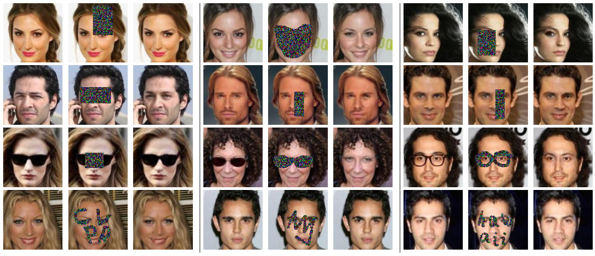

# GenerativeFaceCompletion
Matcaffe implementation for our CVPR17 [paper](https://drive.google.com/file/d/0B8_MZ8a8aoSeMjRFM2VYdVR4Q1U/view) on face completion.


In each panel from left to right: original face, masked input, completion result.

## Setup

- We use the caffe version v2.5.48. Please refer [Caffe](http://caffe.berkeleyvision.org/installation.html) for more installation details.
- Basically, you need to first modify the [MATLAB_DIR](https://github.com/BVLC/caffe/issues/4510) in Makefile.config and then run the following commands for a successful compilation:
```
make all -j4
make matcaffe
```

## Training
- Follow the [DCGAN](https://github.com/soumith/dcgan.torch) framework to prepare the CelebA training dataset. The only differece is that the face we cropped is of size 128. Please modify Line 10 in their [crop_celebA.lua](https://github.com/soumith/dcgan.torch/blob/master/data/crop_celebA.lua) file.

- Modify the training data path in ./matlab/FaceCompletion_training/GFC_caffeinit.m file.

- Download our face parsing model [Model_parsing](https://drive.google.com/open?id=0B8_MZ8a8aoSeaXlUR296TzM2NW8) and put it under ./matlab/FaceCompletion_training/model/ folder.

- We provide an initial [model](https://drive.google.com/open?id=0B8_MZ8a8aoSeWWtldlhXSjdydVk) that is only trained with the reconstruction loss, as a good start point for the subsequent GAN training. Please download it and put it under ./matlab/FaceCompletion_training/model/ folder.

- Run ./matlab/FaceCompletion_training/demo_GFC_training.m for training.

## Testing
- Download our face completion model [Model_G](https://drive.google.com/open?id=0B8_MZ8a8aoSeQlNwY2pkRkVIVmM) and put it under ./matlab/FaceCompletion_testing/model/ folder. Testing images are from the CelebA test dataset.
- Run ./matlab/FaceCompletion_testing/demo_face128.m for completion.

## Citation
```
@inproceedings{GFC-CVPR-2017,
    author = {Li, Yijun and Liu, Sifei and Yang, Jimei and Yang, Ming-Hsuan},
    title = {Generative Face Completion},
    booktitle = {IEEE Conference on Computer Vision and Pattern Recognition},
    year = {2017}
}
```

## Acknowledgement
- Gratitude goes to [Sifei Liu](https://github.com/Liusifei) for the great help on code.
- The [upsample](https://github.com/alexgkendall/caffe-segnet/blob/segnet-cleaned/src/caffe/layers/upsample_layer.cpp) layer (unpooling according to the pooling mask) is borrowed from the [SegNet](https://arxiv.org/abs/1511.00561).
